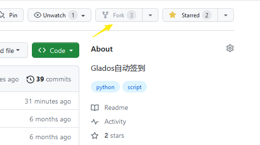
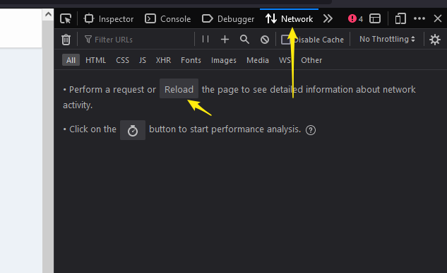
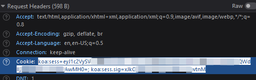
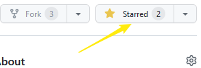

# Glados自动签到

## 食用方式：

### 注册一个GLaDOS的账号([注册地址](https://glados.space/landing/0A58E-NV28S-6U3QV-33VMG))

#### 我的邀请码：([0A58E-NV28S-6U3QV-33VMG](https://0a58e-nv28s-6u3qv-33vmg.glados.space)) 

#### 我的优惠码（9折）：([DEVILSTORE](https://0a58e-nv28s-6u3qv-33vmg.glados.space)) 

### **Fork**本仓库



### 添加**secret**

1. 跳转至自己的仓库的`Settings`->`Secrets and variables`->`Action`

2. 添加1个`repository secret`，命名为`GLADOS_COOKIES`，其值对应GLaDOS账号的cookie值中的有效部分（获取方式如下）

- 在GLaDOS的签到页面按`F12`

- 切换到`Network`页面下，刷新



- 点击第一个选项卡后在`Request Headers`下找到`Cookie`，右键复制cookie的值即可

  > 参考格式：koa:sess=eyJ1c2xxxxxxxxxxxxxxxxxxxxxxxxxxxxxxxxxxxxxxxxxxAwMH0=; koa:sess.sig=xJkOxxxxxxxxxxxxxxxtnM;



- 多账号请在 `COOKIES` 中 添加多个 `cookies` 中间使用 `&`连接即可。（例如： `c1&c3&c3...`）

3. 指定签到域名（非必须）

- 脚本只对**一个**域名签到，默认 `glados.cloud`。若你的账号在别的域名下（例如 `railgun.info`），添加1个`repository secret`，命名为`GLADOS_DOMAIN`，值填该域名即可（填 `railgun.info` 或 `https://railgun.info` 都可以）。

> 不配置时使用默认域名 `glados.cloud`。请确保 `GLADOS_COOKIES` 里的 cookie 与该域名匹配，否则会签到失败。

4. 手机推送（非必须）

- 添加1个`repository secret`，命名为`PUSHDEER_SENDKEY`，其值对应 PushDeer key: ([获取地址](https://www.pushdeer.com/product.html))。

5. Telegram 推送（非必须）

- 添加2个`repository secret`，两个都设置后才会启用：

| 名称 | 说明 |
|---|---|
| `TG_BOT_TOKEN` | 向 [@BotFather](https://t.me/BotFather) 发送 `/newbot` 创建机器人后拿到的 token，形如 `123456789:AAxxxxxxxxxxxxxxxxxx` |
| `TG_CHAT_ID` | 你的用户 ID 或群组 ID。给 [@userinfobot](https://t.me/userinfobot) 发条消息即可拿到自己的 ID；群组 ID 以 `-` 开头 |

> 创建完机器人后记得先在 Telegram 里主动给它发一条消息（群组则把它拉进群），否则机器人无权给你发消息。

**推送时机**：

- 每次运行都推一条签到结果（成功、重复、失败都推，这样账号失效时不会静默）
- 总积分每跨过一个整百刻度（100、200、300……）时，**额外**再推一条里程碑通知

PushDeer 和 Telegram 两个渠道互不影响，配了哪个就推哪个，都配则都推。

### **star**自己的仓库



## 文件结构

```shell
│  checkin.py	# 签到脚本
│
├─.github
│  └─workflows
│          gladosCheck.yml	# Actions 配置文件
```

## 更新日志

- **2026-01**: 重构代码，添加log输出方便定位，支持新版网址，支持配置积分兑换策略。
- **2026-04**: 优化代码逻辑，优化日志输出，支持[新版域名](https://railgun.info) ，在 GLADOS_COOKIES 中添加新版域名下的 cookies 即可使用。
- **2026-08**: 改为只对单一域名签到（默认 `glados.cloud`，可用 `GLADOS_DOMAIN` 覆盖），不再逐个域名尝试；移除自动兑换积分，兑换时机自行在网页端决定；新增 Telegram 推送，总积分每跨过一个整百刻度额外推送一次。


## 问题排查与定位
- 大家可以通过查询 actions 中的 running checkin 日志快速定位问题，有其他问题提交issue。

  

## 声明

本项目不保证稳定运行与更新, 因GitHub相关规定可能会删库, 请注意备份


